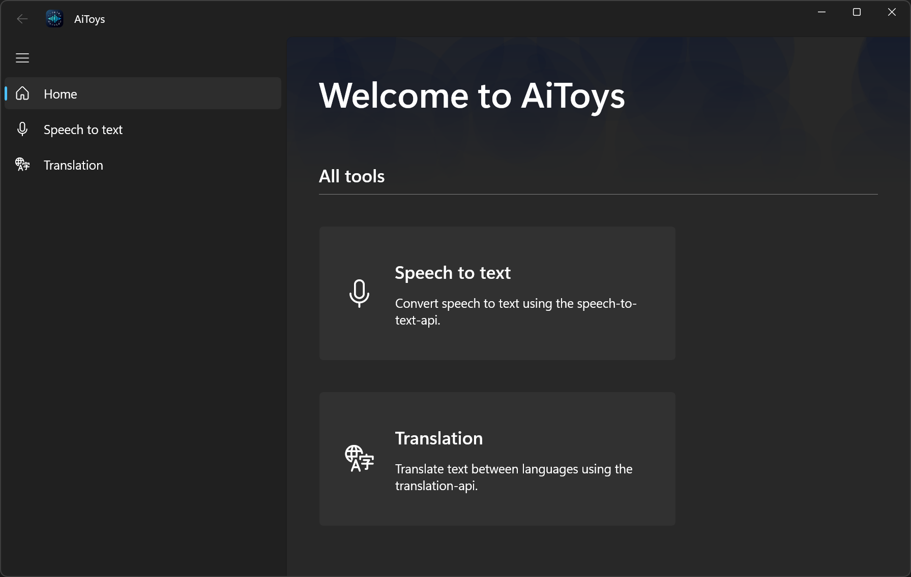
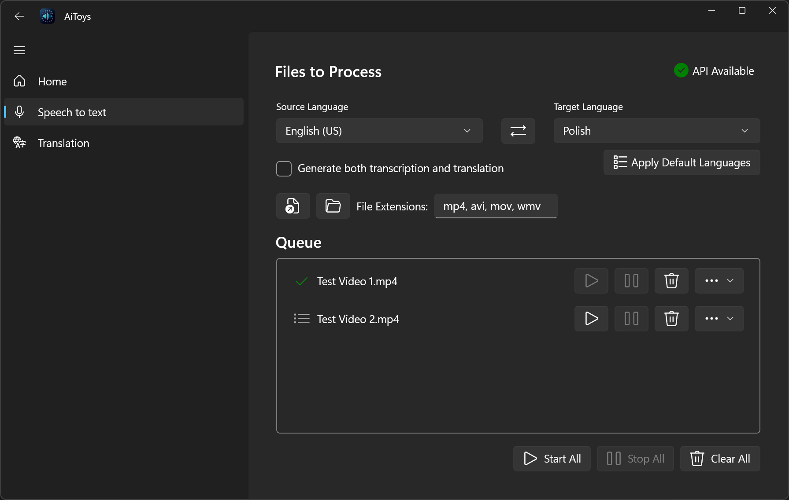
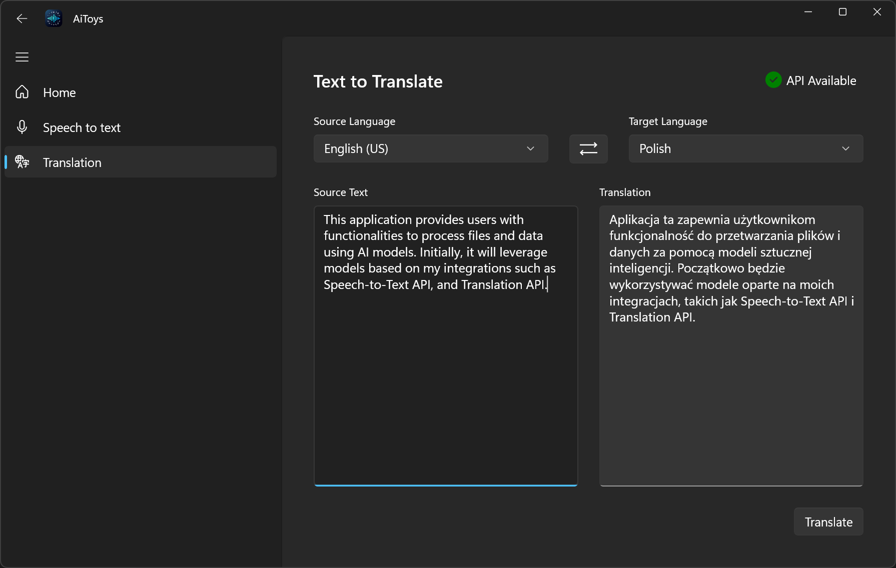

# AiToys

AiToys is a modern desktop application that harnesses AI models to process audio, video, and text. With a sleek, user-friendly interface, it provides powerful speech-to-text transcription and language translation capabilities while keeping all processing local on your machine.

## Features

### Speech-to-Text Processing

- **Audio/Video Transcription**: Generate SRT subtitle files from supported media files
- **Translation Integration**: Create translated subtitles directly from media files
- **Batch Processing**: Add multiple files to a processing queue with individual settings
- **Dual Output Option**: Generate both transcription and translation simultaneously

### Text Translation

- **Direct Text Translation**: Translate text between multiple languages
- **Language Selection**: Choose from supported source and target languages
- **Clean Interface**: Simple two-panel layout for efficient translation workflow

### Core Benefits

- **Local Processing**: All file processing happens locally - no data is sent over the internet
- **Real-time Status**: API availability indicators ensure you know when services are ready
- **Modern UI**: Clean, intuitive interface with dark mode support
- **Cross-language Support**: Process content between multiple languages

## Setup Requirements

AiToys requires local API services to function:

- **Speech-to-Text API**: Must be running locally (default: [http://localhost:9001](http://localhost:9001))
- **Translation API**: Must be running locally (default: [http://localhost:9003](http://localhost:9003))

You can configure the API endpoints in the application's settings file.

> **Important**: Without these local API services running, the application cannot function properly. The status indicators in the UI will show when APIs are available.

## Installation Options

- **Self-contained Executable**: Download the standalone .NET 9 application from the [releases page](https://github.com/ggwozdz90/ai-toys/releases) - no .NET runtime installation required
- **MSIX Package**: Install using the Windows MSIX package for a fully integrated experience

## API Integration

AiToys integrates with:

- [Speech-to-Text API](https://github.com/ggwozdz90/speech-to-text-api) - Provides transcription using OpenAI's Whisper model and translation using Seamless and mBART models
- [Translation API](https://github.com/ggwozdz90/translation-api) - Enables translation using Seamless or mBART models

For local API setup, you can:

- Run the APIs directly from executables
- Use Docker images for the APIs (available on Docker Hub) [Speech-to-Text API](https://hub.docker.com/r/ggwozdz/speech-to-text-api) / [Translation API](https://hub.docker.com/r/ggwozdz/translation-api)
- Use the [home-lab](https://github.com/ggwozdz90/home-lab) project to set them up with Docker

## Usage Examples

### Transcribing a Video File

1. Navigate to the "Speech to text" section
2. Select your source and target languages
3. Add video files to the queue using the file selector
4. Optionally enable "Generate both transcription and translation"
5. Process individual files or use "Start All" to process the entire queue
6. New files will be created in the same directory as the source files with the same name and a .xx_XX.srt extension

### Translating Text

1. Navigate to the "Translation" section
2. Select your source and target languages
3. Enter text in the source panel
4. Click "Translate" to generate the translation

## Related Projects

- [Speech-to-Text CLI](https://github.com/ggwozdz90/speech-to-text-cli) - Command-line alternative for transcription
- [Speech-to-Text API Client](https://github.com/ggwozdz90/speech-to-text-api-client) - Library used for API communication
- [Speech-to-Text API](https://github.com/ggwozdz90/speech-to-text-api) - API for transcription and translation
- [Translation API Client](https://github.com/ggwozdz90/translation-api-client) - Library for translation API integration
- [Translation API](https://github.com/ggwozdz90/translation-api) - API for translation services
- [home-lab](https://github.com/ggwozdz90/home-lab) - Docker setup for local API services
- [C# Project Template](https://github.com/ggwozdz90/csharp-project-template) - Template for creating new C# projects with CI/CD support
- [FastAPI Project Template](https://github.com/ggwozdz90/fastapi-project-template) - Template for creating new FastAPI projects with CI/CD support

## License

This project is licensed under the MIT License - see the LICENSE file for details.

## Table of Contents

- [AiToys](#aitoys)
  - [Features](#features)
    - [Speech-to-Text Processing](#speech-to-text-processing)
    - [Text Translation](#text-translation)
    - [Core Benefits](#core-benefits)
  - [Setup Requirements](#setup-requirements)
  - [Installation Options](#installation-options)
  - [API Integration](#api-integration)
  - [Usage Examples](#usage-examples)
    - [Transcribing a Video File](#transcribing-a-video-file)
    - [Translating Text](#translating-text)
  - [Related Projects](#related-projects)
  - [License](#license)
  - [Table of Contents](#table-of-contents)
